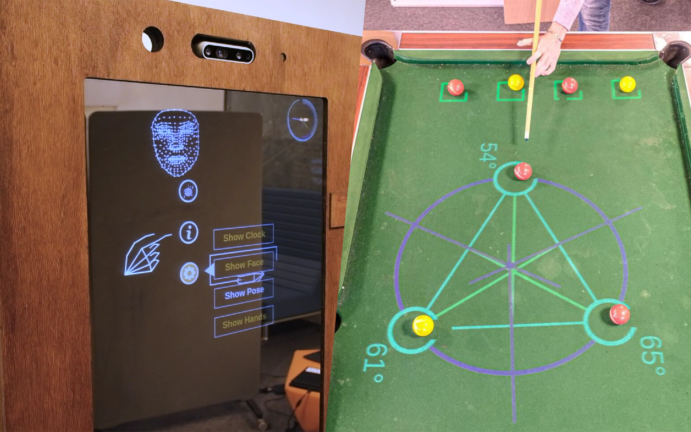

# General-purpose Operating System for Augmented Interfaces

Base repository of the GOSAI project. This is an open-source and collaborative project to create augmented reality plateforms.

## Requirements

Docker is required to use this project

Edit the .env file to to set your dockerhub username, the repository you want to push it to, the name of the platform you are using and optional device and version to keep track of changes.

## Quickstart

|Action                 |Command      |
|:----------------------|:------------|
|Build the image        |`make build` |
|Launch (with docker)   |`make launch`|
|Stop                   |`make stop`  |
|Push on Docker         |`make push`  |
|Pull from Docker       |`make pull`  |

## Deployement

The following is one way to deploy this project using systemctl.

Create a service in
